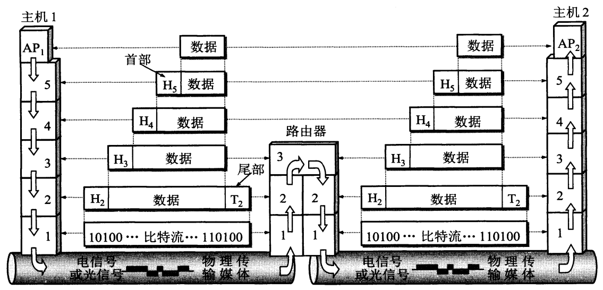

[TOC]

#### 1.1 计算机网络在信息时代中的作用

网络分类：电信网络、有线电视网络、计算机网络

互联网基本特点：连通性、资源共享

#### 1.2 互联网概述

##### 1.2.1 网络的网络

计算机网络由若干结点（ node ）和连接这些结点的链路（ link ）组成。网络的结点可以是计算机、集线器、交换机或路由器等

网络之间可以通过路由器互连起来，构成范围更大的计算机网络，称为互连网，是“网络的网络”

网络把许多计算机连接在一起，而互连网则把许多网络通过路由器连接在一起。与网络相连的计算机常称为主机（ host ）

> internet: 互连网，是一个通用名词，泛指由多个计算机网络互连而成的计算机网络
>
> Internet: 互联网，或因特网，是一个专用名词，指当前全球最大的、开放的、由众多网络相互连接而成的特定互连网，采用 TCP/IP 协议族作为通信的规则，其前身是美国的 APRANET

##### 1.2.2 互联网基础结构发展的三个阶段

1. 由单个网络 ARPANET 向互连网发展

   1969 年美国国防部创建的第一个分组交换网（不是互连网）

   1983 年 TCP/IP 协议成为 APRANET 上的标准协议，是互联网诞生时间

2. 三级结构的互联网

   1985 年，NSFNET 是一个三级计算机网络，分为主干网、地区网和校园网（或企业网）

3. 多层次 ISP 结构的互联网

   NSFNET 被互联网主干网替代，出现 ISP 互联网服务提供商，如中国电信

   ISP 分类：主干、地区、本地

   

   IXP 互联网交换点：允许两个网络直接相连并交换分组，而不需要再通过第三个网络来转发分组

#### 1.3 互联网的组成

1. 边缘部分：由所有连接在互联网上的主机组成，是用户直接使用的
2. 核心部分：由大量网络和连接这些网络的路由器组成，是为边缘部分提供服务的

##### 1.3.1 互联网的边缘部分

1. 客户-服务器方式

   客户（ client ）是服务请求方，服务器（ server ）是服务提供方

2. 对等连接方式

   对等连接（ peer-to-peer ，简写为 P2P ）是指两台主机在通信时并不区分哪一个是服务请求方哪一个是服务提供方。只要两台主机都运行了对等连接软件（ P2P 软件），它们就可以进行平等的、对等连接通信

##### 1.3.2 互联网的核心部分

在网络核心部分其特殊作用的是路由器（ router ），是一种专用计算机（但不叫主机），是实现分组交换（ packet switching ）的关键构件，其任务是转发收到的分组。

1. 电路交换的主要特点

   从通信资源的分配角度来看，交换（ switching ）就是按照某种方式动态地分配传输线路的资源

   必须经过“建立连接（占用通信资源）→通话（一直占用通信资源）→释放连接（归还通信资源）”三个步骤的交换方式称为电路交换

   电路交换的线路的传输效率往往很低

2. 分组交换的主要特点

   采用存储转发技术

   把要发送的整块数据称为一个报文（ message ），在发送报文之前，先把较长的报文划分成一个个更小的登场数据段，在每一个数据段前面，加上一些由必要的控制信息组成的首部（ header ）后，就构成了一个分组（ packet ），又称为“包头”，首部又称为“包头”。分组是互联网中传送的数据单元，首部包含了诸如目的地址和源地址等中重要控制信息，每一个分组才能在互联网中独立地选择传输路径，并被正确地交付到分组传输的终点

   主机是为用户进行信息处理的，路由器则是用来转发分组的，即进行分组交换的

   路由器收到一个分组，先暂时存储一下，检查其首部，查找转发表，按照首部中的目的地址，找到合适的接口转发出去，把分组交给下一个路由器。这样一步一步地以存储转发的方式，把分组交付给最终的目的主机。各路由器之间必须经常交换彼此掌握的路由信息，以便创建和动态维护路由器中的转发表，使得转发表能够在整个网络拓扑发生变化时及时更新

   路由器暂时存储的是一个个短分组，暂存在路由器的内存中

   分组交换的优点：

   | 优点 | 所采用的手段                                                 |
   | ---- | ------------------------------------------------------------ |
   | 高效 | 在分组传输的过程中动态分配传输带宽，对通信链路是逐段占用     |
   | 灵活 | 为每一个分组独立地选择最合适的转发路由                       |
   | 迅速 | 以分组作为传送单位，可以不先建立连接就能向其他主机发送分组   |
   | 可靠 | 保证可靠性的网络协议；分布式多路由的分组交换网，使网络有很好的生存性 |

   分组交换的缺点：

   - 分组在各路由器存储转发时需要排队，造成时延
   - 各分组必须携带的控制信息造成一定的开销

   

#### 1.5 计算机网络的类别

##### 1.5.1 按照网络的作用范围进行分类

- 广域网 WAN （ Wide Area Network ）

  是互联网的核心部分，连接广域网各结点交换机的链路一般都是高速链路

- 城域网 MAN （ Metropolitan Area Network ）

- 局域网 LAN （ Local Area Network ）

  校园网、企业网

- 个人区域网 PAN （ Personal Area Network ）

  也称为无线个人区域网 WPAN （ Wireless PAN ）

##### 1.5.2 按照网络的使用者进行分类

- 公用网（ public network ）由电信公司出资建造的大型网络
- 专用网（ private network  ）由某个部门为满足本单位的特殊业务工作的需要而建造的网络
- 虚拟专用网 VPN（ Virtual Private Network ）

##### 1.5.3 用来把用户接入到互联网的网络

- 接入网 AN（ Access Network ）

#### 1.6 计算机网络的性能

##### 1.6.1 性能指标

1. 速率

   也称为数据率或比特率，数据的传送速率，千进制，单位为 bit/s （ 或 bps ）

2. 带宽

   1. 本来是指某个信号具有的频带宽度，表示某信道允许通过的信号频带范围，单位为赫兹
   2. 表示在单位时间内网络中的某信道所能通过的“最高数据率”，单位 bps

3. 吞吐量（ throughput ）

   表示在单位时间内通过某个网络（或信道、接口）的实际的数据量，受速率或带宽限制

4. 时延（ delay 或 latency ）

   指数据（一个报文或分组，甚至比特）从网络（或链路）的一端传送到另一端所需的时间，也称延迟或迟延。网络中的时延由以下部分组成：

   1. 发送时延（ transmission delay ）是由主机或路由器发送数据帧所需要的时间，也叫传输时延，计算公式是$\displaystyle 发送时延=\frac{数据帧长度（bit）}{发送速率（bit/s）}$。与传输信道的长度（或信号传送的距离）无关
   2. 传播时延（ propagation delay ）是电磁波在信道中传播一定的距离需要花费的时间，计算公式是$\displaystyle 传播时延=\frac{信道长度（m）}{电磁波在信道上的传播速率（m/s）}$。与信号的发送速率无关
   3. 处理时延 是主机或路由器在收到分组时处理所发费的时间
   4. 排队时延 是分组在进入路由器后等待转发的时间

   $\displaystyle 总时延=发送时延+传播时延+处理时延+排队时延$

5. 时延带宽积

   $\displaystyle 时延带宽积=传播时延*带宽$

   用时间作为单位来表示链路长度，截面积就是链路的带宽，因此时延带宽积表示链路可容纳的比特数量，又称为以比特为单位的链路长度。链路只有在充满比特时才得到充分的利用

6. 往返时间 RTT （ Round-Trip Time ）

   双向交互一次所需的时间

7. 利用率

   - 信道利用率 是指某信道有百分之几的时间是被利用的（有数据通过）
   - 网络利用率 是全网络的信道利用率加权平均值

   根据排队论的理论，令 $D_0$ 表示网络空闲时的时延， $D$ 表示网络当前的时延，可以用 $\displaystyle D=\frac{D_0}{1-U}$ 表示 $D$ ， $D_0$ 和利用率 $U$ 之间的关系，信道或网络的利用率过高会产生非常大的时延，临界值一般为 $\displaystyle \frac{1}{2}$

##### 1.6.2 非性能特征

​	费用、质量、标准化、可靠性、可扩展性和可升级性、易于管理和维护

#### 1.7 计算机网络体系结构

##### 1.7.1 计算机网络体系结构的形成

国际标准化组织 ISO 于 1977 年提出开放系统互连基本参考模型 OSI/RM （ Open Systems Interconnection Reference Model ），简称 OSI 。但被广泛应用的是 TCP/IP

##### 1.7.2 协议与划分层次

为进行网络中的数据交换而建立的规则、标准或约定成为网络协议（ network protocol ），简称协议，由三要素组成：

1. 语法，即数据与控制信息的结构或格式
2. 语义，即需要发出何种控制信息，完成何种动作以及做出何种响应
3. 同步，即事件完成顺序的详细说明

计算机网络的各层及其协议的集合就是网络的体系结构

##### 1.7.3 具有五层协议的体系结构

<table border="0" cellspacing="0" cellpadding="0" class="ta1"><colgroup><col width="219"/><col width="219"/><col width="219"/></colgroup><tr class="ro1"><td style="text-align:left;width:50.01mm; " class="ce1">
OSI 体系结构
</td><td style="text-align:left;width:50.01mm; " class="ce1">
TCP/IP 体系结构
</td><td style="text-align:left;width:50.01mm; " class="ce1">
五层协议的体系结构
</td></tr><tr class="ro1"><td style="text-align:left;width:50.01mm; " class="ce2">
应用层
</td><td rowspan="3" style="text-align:left;width:50.01mm; " class="ce2">
应用层

（ TELNET, FTP, SMTP ）
</td><td rowspan="3" style="text-align:left;width:50.01mm; " class="ce2">
应用层
</td></tr><tr class="ro1"><td style="text-align:left;width:50.01mm; " class="ce2">
表示层
</td></tr><tr class="ro1"><td style="text-align:left;width:50.01mm; " class="ce2">
会话层
</td></tr><tr class="ro1"><td style="text-align:left;width:50.01mm; " class="ce2">
运输层
</td><td style="text-align:left;width:50.01mm; " class="ce2">
运输层（ TCP 或 UDP）
</td><td style="text-align:left;width:50.01mm; " class="ce2">
运输层
</td></tr><tr class="ro1"><td style="text-align:left;width:50.01mm; " class="ce2">
网络层
</td><td style="text-align:left;width:50.01mm; " class="ce2">
网际层（ IP ）
</td><td style="text-align:left;width:50.01mm; " class="ce2">
网络层
</td></tr><tr class="ro1"><td style="text-align:left;width:50.01mm; " class="ce2">
数据链路层
</td><td rowspan="2" style="text-align:left;width:50.01mm; " class="ce2">
网络接口层
</td><td style="text-align:left;width:50.01mm; " class="ce2">
数据链路层
</td></tr><tr class="ro1"><td style="text-align:left;width:50.01mm; " class="ce2">
物理层
</td><td style="text-align:left;width:50.01mm; " class="ce2">
物理层
</td></tr></table>

1. 应用层（ application layer ）

   任务是通过应用进程间的交互来完成特定网络应用，定义的是应用进程间通信和交互的规则。如 DNS, HTTP, SMTP 等。交互的数据单元称为报文（ message ）

2. 运输层（ transport layer ）

   任务是为两台主机中进程之间的通信提供通用的数据传输服务，有分用和复用的功能

   分用：运输层把收到的信息分别交付应用层中的相应进程

   复用：多个应用层进程可同时使用运输层的服务

   运输层主要使用两种协议：

   - 传输控制协议 TCP （ Transmission Control Protocol ）：提供面向连接的、可靠的数据传输服务，其数据传输的单位是报文段（ segment ）
   - 用户数据报协议 UDP （ User Datagram Protocol ）：提供无连接的、尽最大努力的数据传输服务（不保证可靠性），其数据传输的单位是用户数据报

   **区别运输（ Transport ）和传输（ Transmission ），使用运输层的译名更准确**

3. 网络层（ network layer ）

   负责为分组交换网上的不同主机提供通信服务。把运输层产生的报文段和用户数据报封装成分组或包进行传送。由于使用 IP 协议，因此分组也叫作 IP 数据报，或简称为数据报。

   **把“分组”和“数据报”看作同义词**

   网络层的另一个任务是选择合适的路由，使源主机运输层所传下来的分组，能够通过网络中的路由器找到目的主机。也叫作网际层或 IP 层

4. 数据链路层（ data link layer ）

   简称为链路层。将网络层交下来的数据报组装成帧（ framing ），在两个相邻结点间的链路上传送帧（ frame ），每一帧包含数据和必要的控制信息（如同步信息、地址信息、差错控制等）。如果帧有差错，会被数据链路层简单地丢弃。可以采用复杂的可靠传输协议来纠正出现的差错

5. 物理层（ physical layer ）

   所传数据的单位是比特。不包括物理媒体（如双绞线、光缆）。

对等层次（ peer layers ）之间传送的数据单位称为该层的协议数据单元 PDU （ Protocol Data Unit ）

##### 1.7.4 实体、协议、服务和服务访问点

实体（ entity ）表示任何发送或接收信息的硬件或软件进程

协议是控制两个对等实体（或多个实体）进行通信的规则的集合

在协议的控制下，两个对等实体间的通信使得本层能够向上一层提供服务，本层协议的实现需要使用下面一层所提供的服务

**协议是控制对等实体之间通信的规则，服务是由上层向上层通过层间接口提供的**

只有能被高一层实体使用的功能才能称之为“服务”，上层通过服务原语使用下层的服务

相邻两层的实体进行交互的地方，称为服务访问点（ Service Access Point ），层与层之间交换的数据的单位称为服务数据单元 SDU （ Service Data Unit ）

##### 1.7.5 TCP/IP 的体系结构

