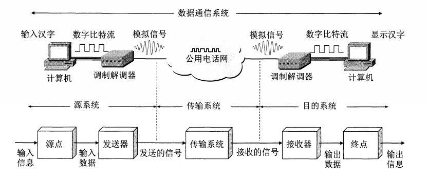
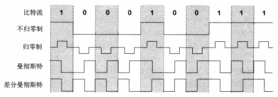
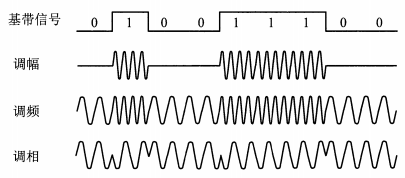
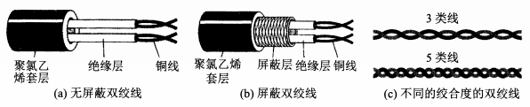
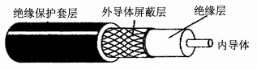
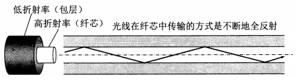
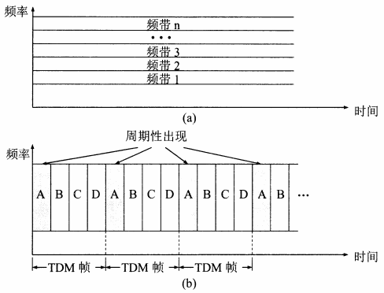
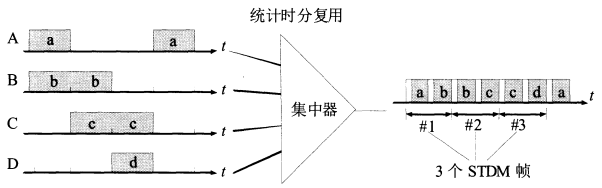

[TOC]

#### 2.1 物理层的基本概念

用于物理层的协议也常被称为物理层规程（ procedure ）。物理层的主要任务为确定与传输媒体的接口有关的一些特性，即：机械特性、电气特性、功能特性、过程特性。数据的传输方式一般是串行传输（处于经济考虑）。

#### 2.2 数据通信的基础知识

##### 2.2.1 数据通信系统的模型

通信的目的是传送消息（ message ），数据（ data ）是运送消息的实体

信号（ signal ）则是数据的电气或电磁的表现。

- 模拟信号，或连续信号——代表消息的参数的取值是连续的
- 数字信号，或离散信号——代表消息的参数的取值是离散的。在使用时间域（或简称为时域）的波形表示数字信号时，代表不同离散数值的基本波形就称为码元，二进制只有 0/1 两种码元

##### 2.2.2 信道的概念

信道（ channel ）和电路不等同，用来表示向一个方向传送信息的媒体，一条通信电路往往包含一条发送信道和一条接收信道，从通信的双方信息交互的方式来看，有三种基本方式：

1. 单向通信，又称为单工通信，只能有一个方向的通信而没有反方向的交互，如广播
2. 双向交替通信，又称为半双工通信，通信的双方都可以发送信息，但双方不能同时发送或接收
3. 双向同时通信，又称为全双工通信，通信的双方可以同时发送和接收信息

单向通信只需要一条信道，双向交替、双向同时通信需要两条信道

**单工、半双工、全双工不是正式名词**

来自信源的信号称为基带信号（基本频带信号），需要进行调制（ modulation ）。调制分为两大类，一类是仅仅对基带信号的波形进行变换，变换后的信号仍然是基带信号，称为基带调制，也称为编码（ coding ）；另一类调制需要使用载波（ carrier ）进行调制，把基带信号的频率范围搬移到较高的频段，并转换为模拟信号，载波调制后的信号称为带通信号，这种调制称为带通调制

###### 2.2.2.1 常用编码方式

- 不归零制：正电平 1 ，负电平 0
- 归零制：比不归零制有电压有零点
- 曼彻斯特编码：位中心向上跳变为 0 ，向下跳变为 1
- 差分曼彻斯特编码：每一位都有跳变，位开始跳变为 1 ，位开始无跳变为 0

###### 2.2.2.2 基本带通调制方法

- 调幅（ AM ）：0 无载波，1 有在载波
- 调频（ FM ）：0 和 1 对应不同的频率
- 调相（ PM ）：0 和 1 对应不同的相位

##### 2.2.3 信道的极限容量

限制码元在信道上的传输速率的因素：

1. 信道能够通过的频率范围

   码间串扰：接收端收到的信号波形失去了码元之间的清晰界限

   在任何信道中，码元传输的速率是有上限的，传输速率超过此上限，就会出现严重的码间串扰的问题，使接收端对码元的识别称为不可能

2. 信噪比

   信噪比是信号的平均功率和噪声的平均功率之比，记为 S/N ，用分贝（ dB  ）作为单位，$信噪比(dB)=10\log_{10}(S/N)(dB)$

   香农（ Shannon ）公式指出信道的极限信息传输速率$C=W\log_{2}(1+S/N)(bit/s)$，W 是信道的带宽（单位 Hz ），S 是信道内所传信号的平均功率，V 是信道内部的高斯噪声功率

   信噪比越大，信息的极限传输速率就越高

   用不同的相位来表示不同的码元，让每一个码元携带更多比特的信息量

#### 2.3 物理层下面的传输媒体

传输媒体分为导引型（ guided ）传输媒体和非导引型传输媒体，可以理解为有线和无线

##### 2.3.1 导引型传输媒体

1. 双绞线

   又叫双扭线，两根相互绝缘的铜导线并排放在一起，然后用规则的方法绞合（ twist ）起来就构成了双绞线。绞合可减少对相邻导线的电磁干扰。距离太长需要用放大器或中继器

   在双绞线外面再加上一层用金属丝编织成的屏蔽层，就是屏蔽双绞线，简称 STP （ Shield Twisted Pair ）

   

2. 同轴电缆

   由内导体铜质芯线、绝缘层、网状编织的外导体屏蔽层以及保护塑料外层所组成。抗干扰，主要用于有线电视

   

3. 光缆

   利用光导纤维传递光脉冲来通信

   

   可以存在多条不同角度入射的光纤在一条光纤中传输，称为多模光纤；若光纤的致敬减小到只有一个光的波长，则可使光线一直向前传播，而不会产生多次反射，称为单模光纤

4. 架空明线

##### 2.3.2 非引导型传输媒体

短波通信（即高频通信）主要靠电离层的反射，电离层的不稳定所产生的衰落现象和电离层反射所产生的多径效应使得短波信道的通信质量较差，一般是低速传输

无线电微波通信主要使用 2 ~ 40 GHz 的频率范围，会穿透电离层进入宇宙空间，主要有地面微波接力通信和卫星通信。为实现远距离通信必须在一条微波通信信道的两个终端之间建立若干个中继站，中继站把前一站送来的信号放大后再发送到下一站，称为“接力”。卫星通信距离远，容量大，传播时延大

红外通信、激光通信也使用非引导型媒体，可用于近距离的笔记本电脑相互传送数据

#### 2.4 信道复用技术

##### 2.4.1 频分复用、时分复用、统计时分复用

频分复用 FDM （ Frequency Division Multiplexing ）：所有用户在同样的时间占用不同的带宽资源（这里的带宽指频率带宽）

时分复用 TDM ：将时间划分为一段段等长的时分复用帧（ TDM 帧 ），每一个用户在每一个 TDM 帧中占用固定序号的时隙，所有用户在不同的时间占用同样的频带宽度。 TDM 信号也称等时（ isochronous ）信号

复用器（ multiplexer ）和分用器（ demultiplexer ）成对地使用

时分复用，当某用户暂时无数据发送时，在时分复用帧中分配给该用户的时隙只能处于空闲状态，其他用户无法使用，导致信道利用率不高

统计时分复用 STDM （ Statistic TDM ）是一种改进的时分复用，集中器（ concentrator ）常使用这种统计时分复用

集中器能正常工作的前提是假定各用户都是间歇地工作