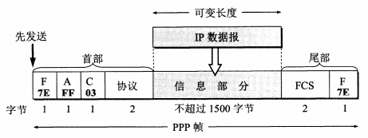
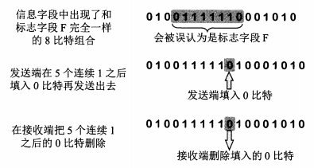

[TOC]

#### 3.1 使用点对点信道的数据链路层

##### 3.1.1 数据链路和帧

链路（ link ）是从一个结点到相邻结点的一段物理线路（有线或无线），而中间没有任何其他的交换结点，只是一条路径的组成部分。把实现通信协议的硬件和软件加到链路上，就构成了数据链路（ data link ）。最常用网络适配器来实现，包括了数据链路层和物理层的功能

数据链路层把网络层交下来的数据构成帧发送到链路上，以及把接收到的帧中的数据取出并上交给网络层，网络层协议数据单元就是 IP 数据报（或简称为数据报、分组或包）

##### 3.1.2 三个基本问题

1. 封装成帧

   封装成帧（ framing ）就是在一段数据的前后分别添加首部和尾部，这样就构成了一个帧。首部和尾部的一个重要作用是帧定界。每一种链路层协议都规定了所能传送的帧的数据部分长度上限，最大传送单元 MTU （ Maximum Transfer Unit ）

2. 透明传输

   透明传输就是无论什么样的比特组合的数据，都能按照原样没有差错地通过数据链路层。所传输的数据中的任何 8 比特的组合一定不允许和用作帧定界的控制字符的比特编码一样，否则就会出现帧定界的错误

   在数据中出现的控制字符前面插入一个转义字符 ESC ，在接收端的数据链路层在把数据送往网络层之前删除这个插入的转义字符，这种方法称为字节填充（ byte stuffing ）或字符填充（ character stuffing ）。如果转义字符也出现在数据中，则在转义字符前面插入一个转义字符

3. 差错检测

   - 比特差错，循环冗余校验
   - 传输差错，帧丢失、帧重复、帧失序，帧编号、确认和重传机制

#### 3.2 点对点协议 PPP

##### 3.2.1 PPP 协议的特点

PPP （ Point-to-Point Protocol ）是用户计算机和 ISP 进行通信时所使用的数据链路层协议

1. PPP 协议应满足的要求
   1. 简单，不纠错，舍弃错误帧
   2. 封装成帧，帧定界符
   3. 保证透明传输
   4. 支持多种网络层协议
   5. 支持多种类型链路
   6. 差错检测，丢弃有差错的帧
   7. 有机制能够自动检测出链路是否处于正常工作状态
   8. 必须设置最大传输单元 MTU 的标准默认值
   9. 必须提供一种机制使通信的两个网络层的实体能够通过协商知道或能够配置彼此的网络层地址
   10. 必须提供一种方法来协商数据压缩算法
2. PPP 协议的组成
   1. 一个将 IP 数据报封装到串行链路的方法
   2. 一个用来建立、配置和测试数据链路链接的链路控制协议 LCP （ Link Control Protocol ）
   3. 一套网络控制协议 NCP （ Network Control Protocol ）

##### 3.2.2 PPP 协议的帧格式

1. 各字段的意义

   首部第一个和尾部第二个字段都是标志字段 F （ Flag ），规定为 0x7E ，表示一个帧的开始或结束。连续的两个帧之间只需要用一个标志字段。两个连续的标志字段表示一个空帧

   首部中的地址字段 A 规定为 0xFF （ 111111 ），控制字段 C 规定为 0x03 

   首部的第四个字段是 2 字节的协议字段，如 0x0021 表示信息字段是 IP 数据报，0xC021 表示信息字段是 PPP 链路控制协议 LCP 的数据，0x8021 表示这是网络层的控制数据

   尾部的第一个 2 字节字段是使用 CRC 的帧检验序列 FCS

   

2. 字节填充

   0x7D 为转义字符

   1. 0x7E 转变为 0x7D, 0x5E
   2. 0x7D 转变为 0x7D, 0x5D
   3. 数值小于 0x20 的控制字符前加 0x7D，如 0x03 转变为 0x7D, 0x23

3. 零比特填充

   在发送端，先扫描整个信息字段，只要发现有 5 个连续的 1 ，就立即在其后填入一个 0 ，这样就保证不会出现 6 个连续的 1 （ 0xFF ）。接收端在收到一个帧时，先找到标志字段 F 以确定一个帧的边界，再对比特流进行扫描，每当发现 5 个连续 1 时，就把这 5 个连续 1 后的一个 0 删除，还原成原来的比特流，这样就不会引起对帧边界的错误判断

   